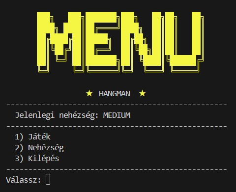
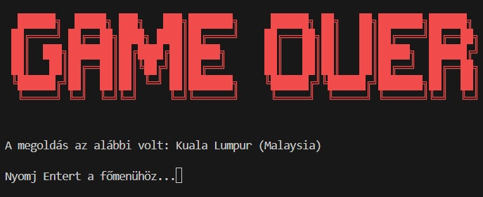

# Hangman – Countries & Capitals Edition

A modular, terminal-based Hangman game built in Python using real-world country and capital data.

## Overview

This project implements a fully functional Hangman game where the player must guess the capital city of a given country.  

The game includes difficulty levels, dynamic word categorization, ASCII-based visual progression, and a modular architecture.

---
## Gameplay Preview

### Main Menu


### Active Gameplay


### Winning Screen


### Game Over Screen


---
## Features

- Real country–capital dataset
- Difficulty levels (Easy / Medium / Hard)
- Dynamic life allocation based on difficulty
- ASCII hangman progression scaled to remaining lives
- Case-insensitive character matching
- Modular project structure
- Clean separation of concerns

---

## Architecture

The project follows a modular structure to ensure readability, maintainability, and logical separation of functionality.

```
hangman.py        → Main game loop and user interface
wordlist.py       → Data loading and difficulty categorization
findchar.py       → Character reveal algorithm
countries-and-capitals.txt → Data source
```

### Module Responsibilities

**hangman.py**
- Controls the main game loop
- Handles user input
- Manages game state
- Displays ASCII hangman progression
- Controls difficulty settings

**wordlist.py**
- Loads the dataset from file
- Categorizes capital cities by length
- Creates difficulty-based word pools

**findchar.py**
- Reveals correctly guessed characters
- Preserves previously revealed letters
- Maintains mask integrity

---

## Difficulty System

The difficulty level affects:

- Word selection pool
- Number of available lives

Classification logic:

- Easy → Capital length ≤ 6 (7 lives)
- Medium → Capital length ≤ 10 (5 lives)
- Hard → Capital length > 10 (3 lives)

Additionally, the ASCII hangman stage dynamically scales according to the ratio of lost lives to total lives.

---

## How to Run

1. Clone the repository:

```
git clone https://github.com/YOUR_USERNAME/hangman-countries-capitals.git
```

2. Navigate into the project directory:

```
cd hangman-countries-capitals
```

3. Run the game:

```
python hangman.py
```

## Gameplay Preview

(Add screenshot or GIF here)

```
Country: France
Capital: _ A R I _
Lives: 4
Wrong guesses: T, B
```

## Technical Highlights

- File-based data ingestion
- Dynamic categorization logic
- ASCII-based visual state progression
- Global state management for difficulty
- Character masking algorithm
- Clean modular design

---

## Authors

Anita Gruber, Nagy Zoltán

---
Data Analytics & Python Portfolio Project

